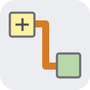

<p align="center"></p>
<h1 align="center">LabSpace</h1>
<p align="center"><strong>Graphical programming. Live instruments. One shared C# engine.</strong></p>
<p align="center"><a href="https://wieslawsoltes.github.io/LabSpace/">Open the studio</a> · <a href="docs/user-guide.md">User guide</a> · <a href="docs/architecture.md">Architecture</a> · <a href="docs/compatibility.md">Compatibility</a></p>

[](https://github.com/wieslawsoltes/LabSpace/actions/workflows/build.yml)
[](https://github.com/wieslawsoltes/LabSpace/actions/workflows/engine.yml)
[](LICENSE)

LabSpace is an independent visual instrumentation workbench built with **Uno Platform and SkiaSharp**. It brings the classic front-panel / block-diagram workflow to desktop and WebAssembly, with original custom controls, a typed executable dataflow graph, signal processing and local-first project files.

> **Early functional implementation — not complete NI LabVIEW parity.** LabSpace does not open NI VI binaries or include NI drivers/runtime components. NI and LabVIEW are trademarks of their respective owners. This project is not affiliated with or endorsed by NI. Read the [compatibility ledger](docs/compatibility.md) before adopting it.

## The studio


Operate numeric controls, knobs and switches; inspect gauges, LEDs, waveform graphs, charts and FFT spectra. The bundled Signal Analysis example is an executable program, not a prerecorded image. Its simulated waveform flows through filtering, RMS, comparison and spectrum functions.


Switch to the block diagram to wire typed terminals, move and duplicate nodes, attach probes, set breakpoints and inspect errors. For, While, Case and embedded SubVI structures contain real editable numeric diagrams. Front-panel controls and diagram terminals share the same model and undo history.

Screenshots are produced by browser acceptance tests of the deployed application. They are not NI artwork or design mockups.

## What works

| Area | Available now |
| --- | --- |
| Workbench | Project explorer, VI tabs, front panel / diagram / split views, classic menu/toolbar, searchable palettes, properties and context help |
| Instruments | Numeric fields, knobs, sliders, gauges, switches, LEDs, strings, numeric arrays, waveform graphs/charts and value cursors |
| Editing | Typed terminal wiring, fan-out, drag/marquee selection, pan/zoom, linked panel edits, duplication, bounded undo/redo and graph clean-up |
| Dataflow | Typed validation, cached topological plans, immutable runtime values, explicit feedback, nested numeric structures and bounded execution |
| Analysis | Sine/square/triangle simulation, gain/offset, block moving average, stable RMS, peak-to-peak and one-sided Hann-windowed FFT |
| Debugging | Run/continuous/pause/abort, top-level step-over, execution highlight, breakpoints, probes and structured error navigation |
| Persistence | Versioned `.labspace.json` projects, browser IndexedDB/native recovery, project import/export and waveform CSV |

All bundled acquisition is **simulated**. The current runtime is not designed or validated for safety-critical equipment control or hard real time.

## Reusable components

| Package | Responsibility |
| --- | --- |
| `LabSpace.Core` | Typed values, nodes, terminals, wires, VIs and panel models |
| `LabSpace.Signals` | Signal generation, stable RMS, filters and FFT |
| `LabSpace.Dataflow` | Validation, compilation, bounded execution, stepping and feedback state |
| `LabSpace.Documents` | Versioned JSON, limits, round trips and example projects |
| `LabSpace.Editing` | Transactions, bounded undo/redo, wiring, selection and layout |
| `LabSpace.Skia` | Diagram, wire, instrument, plot and icon rendering |
| `LabSpace.Storage` | Host-independent persistence and recovery contracts |
| `LabSpace.Controls` | Custom Uno canvas surfaces, palettes, inspector and classic chrome |
| `LabSpace.Workbench` | Composable studio, project explorer, execution UI and in-app help |

All nine libraries are packable. Release automation produces NuGet packages as downloadable artifacts; this does not imply they have been published to the NuGet feed. Desktop and browser share the same engine and workbench.

```csharp
using LabSpace.Dataflow;
using LabSpace.Documents;

// No Uno dependency is needed to execute a virtual instrument.
var vi = Examples.SignalAnalysis();
var plan = GraphCompiler.Compile(vi.Diagram);
var runtime = new DataflowRuntime();
var frame = runtime.Run(plan);
var rms = vi.Diagram.Nodes.Single(node => node.Kind == "rms");
Console.WriteLine(frame.Values[rms.Id]);
```

## Build and run

The verified toolchain is .NET SDK **10.0.401**, Uno SDK **6.7.30**, Uno WinUI **6.7.135**, and the compatible SkiaSharp **3.119.4** managed/native line. The newer standalone SkiaSharp major is deliberately not mixed with Uno's native ABI. Renderers use `SKCanvasElement` in the actual Uno application; graphics acceleration depends on the host and may fall back to software. Signal kernels currently execute in managed C#, not WebGPU compute.

```sh
python3 scripts/fetch-assets.py
dotnet test tests/LabSpace.Tests -c Release

# Shared native host; no WebAssembly workload is needed for this command.
dotnet run --project src/LabSpace.App -f net10.0-desktop -p:LabSpaceDesktopOnly=true

# Browser build and local server.
dotnet workload install wasm-tools --skip-manifest-update
dotnet publish src/LabSpace.App -f net10.0-browserwasm -c Release \
  -o artifacts/publish -p:WasmShellWebAppBasePath=/LabSpace/
python3 scripts/collect-site.py artifacts/publish artifacts/site
python3 scripts/serve-site.py --directory artifacts/site --port 4173
```

Open `http://127.0.0.1:4173/LabSpace/`. The asset script retrieves an OFL-licensed font from a public upstream and verifies its immutable content hash. No proprietary NI or local system fonts are copied.

## Validation and delivery

Engine tests cover execution, DSP, graph errors, nested structures, serialization, transactions and recovery. Playwright tests use real pointer/keyboard events and project downloads, with opt-in **read-only** model/hit-target diagnostics. Pixel checks prevent loading screens from being mistaken for rendered UI. Browser validation is repeated against the public Pages deployment.

GitHub Actions builds the native host on **Windows, Linux and macOS**, publishes the real WebAssembly app, retains source/validation artifacts, checks deployment commit provenance and deploys Pages. The release workflow packs all reusable libraries and the browser distribution. Desktop builds are not a claim that every native picker, hardware GPU or operating-system integration has been interactively tested.

## Documentation

[User guide](docs/user-guide.md) · [Architecture](docs/architecture.md) · [Development](docs/development.md) · [Compatibility ledger](docs/compatibility.md) · [Changelog](CHANGELOG.md) · [Security](SECURITY.md) · [Contributing](CONTRIBUTING.md)

## License

LabSpace is MIT licensed. Upstream dependency and font notices are recorded in [THIRD-PARTY-NOTICES.md](THIRD-PARTY-NOTICES.md). The implementation, icons and bundled example programs are independent of NI.
